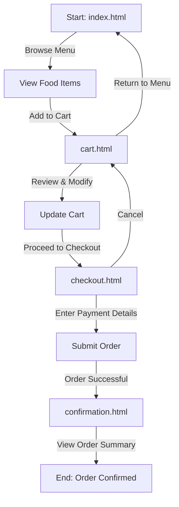

# SpeedyBites - Food Ordering Platform

## Overview
SpeedyBites is a web-based application designed to streamline the food ordering process. Users can browse menus, add items to a cart, proceed to checkout, and receive order confirmations through a responsive and intuitive interface. Built with HTML, CSS, and JavaScript, the project is hosted on GitHub Pages at [https://rajtilak-2020.github.io/SpeedyBites/](https://rajtilak-2020.github.io/SpeedyBites/).

## Features
- **Responsive Design**: Adapts seamlessly to desktops, tablets, and mobile devices using CSS media queries and flexible layouts.
- **Menu Browsing**: Displays food items with details, prices, and images, sourced from a JavaScript data file.
- **Cart Management**: Enables users to add, remove, and adjust item quantities in the cart with real-time updates.
- **Checkout Process**: Simulates a secure payment flow with form validation (demo purposes only).
- **Order Confirmation**: Provides a confirmation page with order details upon successful checkout.
- **Modular JavaScript**: Organized scripts for cart, checkout, UI, and utility functions to enhance maintainability.

## Project Flow
Below is a Mermaid diagram illustrating the user flow through the SpeedyBites application:



## Technologies Used
- **HTML5**: Structures the application's pages (`index.html`, `cart.html`, `checkout.html`, `confirmation.html`).
- **CSS3**: Styles the interface with modular files (`style.css`, `components.css`, `layout.css`, `responsive.css`, `variables.css`) for maintainability and responsiveness.
- **JavaScript**: Powers dynamic features like cart updates, form handling, and UI interactions (`main.js`, `cart.js`, `checkout.js`, etc.).
- **GitHub Pages**: Hosts the static site for public access.
- **External Libraries** (if applicable):
  - [Font Awesome](https://fontawesome.com/) for icons (verify usage in the project).
  - [Google Fonts](https://fonts.google.com/) for typography (verify usage in the project).

## Prerequisites
To run or develop SpeedyBites locally, you need:
- A modern web browser (e.g., Chrome, Firefox, Edge).
- A local server to serve files (recommended to avoid CORS issues). Options include:
  - Python's `http.server`: `python -m http.server 8000`
  - Node.js's `live-server`: `npm install -g live-server && live-server`
- No additional dependencies, as external resources (if any) are loaded via CDNs.

## Installation
1. **Clone the Repository**:
   ```bash
   git clone https://github.com/rajtilak-2020/SpeedyBites.git
   ```
2. **Navigate to the Project Directory**:
   ```bash
   cd SpeedyBites
   ```
3. **Serve the Application**:
   - Option 1: Use a local server:
     ```bash
     python -m http.server 8000
     ```
     Then open `http://localhost:8000` in your browser.
   - Option 2: Use `live-server`:
     ```bash
     live-server
     ```
   - Option 3: Open `index.html` directly in a browser (note: some features may not work due to CORS restrictions).

## Usage
1. **Browse the Menu**: On `index.html`, view food items categorized with details and images.
2. **Add to Cart**: Click "Add to Cart" to include items, then visit `cart.html` to modify quantities or remove items.
3. **Proceed to Checkout**: Navigate to `checkout.html` to enter mock payment details and submit the order.
4. **View Confirmation**: After checkout, `confirmation.html` displays the order summary and confirmation message.

## Project Structure
```
rajtilak-2020-speedybites/
├── cart.html               # Cart page for managing selected items
├── checkout.html           # Checkout page for payment processing
├── confirmation.html       # Order confirmation page
├── index.html              # Main page with menu and navigation
├── assets/                 # Images and other static assets
├── css/
│   ├── components.css      # Styles for reusable UI components
│   ├── layout.css          # Layout-specific styles (e.g., grid, flexbox)
│   ├── responsive.css      # Media queries for responsive design
│   ├── style.css           # General styles and base rules
│   └── variables.css       # CSS custom properties for theming
├── js/
│   ├── cart-page.js        # Logic for cart page interactions
│   ├── cart.js             # Cart management (add, remove, update)
│   ├── checkout.js         # Checkout form validation and processing
│   ├── confirmation.js     # Confirmation page logic
│   ├── data.js             # Menu data and mock API
│   ├── main.js             # Core application logic and initialization
│   ├── ui.js               # UI-related functions (e.g., modals, animations)
│   └── utils.js            # Utility functions (e.g., formatting, helpers)
└── README.md               # Project documentation
```

## Contributing
Contributions are welcome! To contribute:
1. Fork the repository.
2. Create a new branch for your feature or bug fix:
   ```bash
   git checkout -b feature/your-feature-name
   ```
3. Commit your changes:
   ```bash
   git commit -m "Add your feature description"
   ```
4. Push to your branch:
   ```bash
   git push origin feature/your-feature-name
   ```
5. Open a pull request with a detailed description of your changes.

Ensure your code adheres to the project's modular structure and includes comments for clarity.

## Testing
- **Manual Testing**: Interact with all pages (`index.html`, `cart.html`, `checkout.html`, `confirmation.html`) across browsers and devices.
- **Responsive Testing**: Use browser developer tools to test various screen sizes.
- **JavaScript Testing**: Check for console errors during cart updates, form submissions, and page transitions.
- **Future Enhancements**: Add automated tests with Jest or Cypress for JavaScript functions.

## Deployment
The project is deployed on GitHub Pages. To deploy updates:
1. Push changes to the `main` branch:
   ```bash
   git push origin main
   ```
2. GitHub Pages automatically updates the site at [https://rajtilak-2020.github.io/SpeedyBites/](https://rajtilak-2020.github.io/SpeedyBites/).

## Known Issues
- **Payment Gateway**: Mock implementation; real payments require backend integration.
- **Asset Optimization**: Ensure images in `assets/` are compressed to improve load times.
- **Cross-Browser Compatibility**: Test on older browsers for ES6+ and modern CSS support.

## Future Enhancements
- Add user authentication for order history and profiles.
- Integrate a backend (e.g., Node.js, Firebase) for persistent data and real payments.
- Implement menu search and filtering options.
- Enhance UI with animations and transitions.
- Support internationalization for multiple languages.

## License
This project is licensed under the [MIT License](LICENSE). You are free to use, modify, and distribute the code as per the license terms.

## Acknowledgments
- [GitHub Pages](https://pages.github.com/) for hosting the application.
- Open-source community for tools and inspiration.
- [Font Awesome](https://fontawesome.com/) and [Google Fonts](https://fonts.google.com/) (if used) for enhancing the UI.

## Contact
For questions or feedback, contact the project maintainer:
- GitHub: [rajtilak-2020](https://github.com/rajtilak-2020)
- Email: (Add maintainer's email if available)

Thank you for exploring SpeedyBites! Happy ordering!
